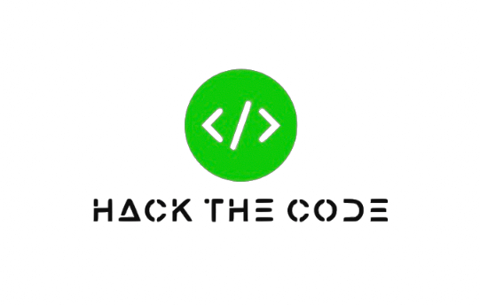

<figure markdown>
{ width="500" }
</figure>

### Welcome to Hack The Code 

**Hack The Code** is your comprehensive resource on cyberattacks and defense methods. Here you’ll find up-to-date information, valuable recommendations, and practical guides—whether you are a professional security engineer or just a user looking to safeguard yourself in the digital world.

### What Will You Find on the Site?

> -- Cyberattack Overviews: Detailed descriptions of various types of attacks—from phishing and DDoS to sophisticated exploits and zero-day vulnerabilities.
 
> -- Defense Strategies: Practical tips and step-by-step instructions on how to protect your data, systems, and networks.
 
> -- Tools and Resources: A curated list of software, utilities, and online services for threat analysis and prevention.

> -- News and Analysis: Current reviews, trends, and analytical materials from the field of cybersecurity.

> -- Educational Materials: Articles, tutorials, and Python code examples to help you master security concepts on your own.

### Our Mission
 We believe that online security should be accessible to everyone. 
 Our goal is to make the complex concepts and practices of cybersecurity understandable and available, thereby enhancing overall digital literacy.

